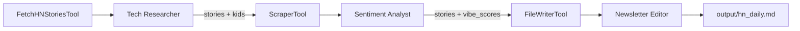

# Add Sentiment Analyst Agent to hn_farm.py

## Overview

Add a Sentiment Analyst agent to the existing CrewAI workflow that analyzes the top 5 comments of each Hacker News story and assigns a "Vibe Score" based on comment sentiment. The Editor agent will incorporate these scores into the generated newsletter.

## Problem Statement / Motivation

The current newsletter generator (`hn_farm.py`) produces a static list of stories without any indication of community reception. Adding sentiment analysis provides readers with quick insight into how the HN community is responding to each story, making the newsletter more informative and engaging.

## Proposed Solution

Insert a new Sentiment Analyst agent between the existing Researcher and Editor agents in the CrewAI workflow:

```
Researcher -> Sentiment Analyst -> Editor
```

**Prerequisites:** Activate the virtual environment before running:
```bash
source .venv/bin/activate  # Linux/macOS
# or
.venv\Scripts\activate     # Windows
```

The workflow will:
1. Researcher fetches top 5 stories with comment IDs (`kids` field)
2. Sentiment Analyst uses a new ScraperTool to fetch top 5 comments per story
3. Analyst assigns a Vibe Score (1-5 scale) based on comment sentiment
4. Editor writes output to `output/hn_daily.md` with vibe scores included

## Technical Approach

### Architecture

The existing two-agent sequential workflow will become a three-agent workflow:



### New Components

#### 1. ScraperTool (Custom Tool)

**File:** `hn_farm.py` (add after FetchHNStoriesTool)

```python
class FetchHNCommentsInput(BaseModel):
    """Input schema for fetch_hn_comments."""
    story_id: int = Field(description="The HN story ID")
    comment_ids: list[int] = Field(
        default=[],
        description="List of comment IDs to fetch (will fetch up to 5)"
    )


class FetchHNCommentsTool(BaseTool):
    name: str = "fetch_hn_comments"
    description: str = (
        "Fetch the top comments for a Hacker News story. "
        "Returns comment text (HTML-stripped), author, and metadata. "
        "Use this to analyze community sentiment."
    )
    args_schema: type[BaseModel] = FetchHNCommentsInput

    def _run(self, story_id: int, comment_ids: list[int] = []) -> str:
        """Fetch up to 5 comments from HN API."""
        # Implementation fetches comments, strips HTML, handles errors
        pass
```

**Input:**
- `story_id`: The HN story ID
- `comment_ids`: List of comment IDs from the story's `kids` field

**Output (JSON string):**
```json
{
  "story_id": 12345,
  "comments": [
    {"id": 111, "text": "Great article!", "by": "user1", "time": 1234567890},
    {"id": 222, "text": "Interesting point...", "by": "user2", "time": 1234567891}
  ],
  "comments_found": 2,
  "errors": []
}
```

#### 2. Sentiment Analyst Agent

**File:** `hn_farm.py` (add after newsletter_editor)

```python
sentiment_analyst = Agent(
    role="Sentiment Analyst",
    goal="Analyze HN comments and assign Vibe Scores to stories",
    backstory=(
        "You are an expert at reading the room. You analyze online discussions "
        "to understand community sentiment. You assign scores on a 1-5 scale "
        "where 1=Very Negative, 2=Negative, 3=Neutral, 4=Positive, 5=Very Positive."
    ),
    tools=[fetch_hn_comments],
    llm=llm,
    verbose=True
)
```

#### 3. Sentiment Analysis Task

**File:** `hn_farm.py` (add between research_task and edit_task)

```python
sentiment_task = Task(
    description=(
        "Analyze the sentiment of comments for each story. "
        "For each story, use the fetch_hn_comments tool with the story's ID "
        "and the first 5 comment IDs from its 'kids' field. "
        "Assign a Vibe Score (1-5) based on the overall sentiment of the comments. "
        "If a story has no comments, assign 'N/A' with reason 'No comments available'.\n\n"
        "Vibe Score Scale:\n"
        "- 1: Very Negative (hostile, dismissive, critical)\n"
        "- 2: Negative (skeptical, concerned, critical)\n"
        "- 3: Neutral (mixed, factual, indifferent)\n"
        "- 4: Positive (interested, approving, supportive)\n"
        "- 5: Very Positive (enthusiastic, praiseworthy, excited)\n\n"
        "Return a JSON list with each story including: id, title, url, vibe_score, vibe_label, vibe_reasoning."
    ),
    expected_output="A JSON list of stories with vibe scores and reasoning.",
    agent=sentiment_analyst,
    context=[research_task]
)
```

#### 4. Update FetchHNStoriesTool

**File:** `hn_farm.py` (modify existing tool)

```python
# Current (line 66-70)
stories.append({
    'id': story_id,
    'title': story.get('title', 'No title'),
    'url': story.get('url', 'No URL')
})

# Updated (add kids field)
stories.append({
    'id': story_id,
    'title': story.get('title', 'No title'),
    'url': story.get('url', f"https://news.ycombinator.com/item?id={story_id}"),
    'kids': story.get('kids', []),  # ADD THIS - comment IDs in ranked order
    'score': story.get('score', 0),
    'by': story.get('by', 'unknown')
})
```

#### 5. Update Editor Task

**File:** `hn_farm.py` (modify edit_task description)

```python
edit_task = Task(
    description=(
        "Take the story data with vibe scores and format it into a professional "
        "Markdown newsletter. Create a file at 'output/hn_daily.md' with:\n"
        "- A header with today's date\n"
        "- A brief intro\n"
        "- Numbered list of stories with:\n"
        "  * Clickable title link\n"
        "  * Vibe score and label (e.g., 'Vibe: 4/5 Positive')\n"
        "  * Brief reasoning for the score\n"
        "  * One-line description\n"
        "- A closing section\n\n"
        "Format each story like:\n"
        "1. **[Title](URL)** *Vibe: 4/5 Positive*\n"
        "   Community shows enthusiasm. Brief description here.\n\n"
        "Use the FileWriterTool with directory='output' and filename='hn_daily.md'."
    ),
    expected_output="A confirmation that output/hn_daily.md has been created with formatted content including vibe scores.",
    agent=newsletter_editor,
    context=[sentiment_task]
)
```

#### 6. Update Crew Assembly

**File:** `hn_farm.py` (modify crew definition)

```python
crew = Crew(
    agents=[tech_researcher, sentiment_analyst, newsletter_editor],
    tasks=[research_task, sentiment_task, edit_task],
    memory=False,
    verbose=True
)
```

### Error Handling

| Error Case | Handling Strategy |
|------------|-------------------|
| Story has no `kids` field | Pass empty array, Analyst assigns "N/A" vibe score |
| `kids` array is empty | Analyst assigns "N/A" with reason "No comments" |
| Comment API returns null (deleted) | Skip to next comment ID, log error |
| Comment has empty `text` field | Skip to next comment ID |
| API timeout (10s) | Retry up to 3 times with exponential backoff |
| API 5xx error | Retry once, then skip story with error note |
| Less than 5 valid comments | Analyze available comments, note count in output |

### Rate Limiting

HN API has no official rate limit, but we should be polite:

```python
API_TIMEOUT_SECONDS = 10
MAX_RETRIES = 3
RETRY_DELAYS = [1, 2, 4]  # seconds, exponential backoff
INTER_REQUEST_DELAY_MS = 150  # delay between comment fetches
MAX_COMMENTS_PER_STORY = 5
```

## System-Wide Impact

- **Interaction graph**: Research task completes → triggers sentiment task → triggers edit task
- **Error propagation**: ScraperTool errors return as JSON with `errors` array; Analyst decides how to handle
- **State lifecycle**: No persistent state; each run is independent
- **API surface parity**: New ScraperTool follows same pattern as existing FetchHNStoriesTool

## Acceptance Criteria

### Functional Requirements

- [x] FetchHNStoriesTool includes `kids` field in story data
- [x] FetchHNCommentsTool fetches up to 5 comments per story
- [x] Comments have HTML stripped from text field
- [x] Sentiment Analyst agent created with ScraperTool
- [x] Vibe Score assigned on 1-5 scale with semantic labels
- [x] Stories with no comments get "N/A" vibe score
- [x] Editor task updated to include vibe scores in output
- [x] output/hn_daily.md includes vibe score for each story
- [x] Crew workflow updated with three agents

### Non-Functional Requirements

- [x] API timeout handling (10 second timeout)
- [x] Retry logic for transient failures (3 retries)
- [x] Graceful handling of deleted comments
- [x] No crashes on missing/malformed data

### Quality Gates

- [x] Manual test: Run `python hn_farm.py` and verify output
- [x] Verify output/hn_daily.md has vibe scores for all 5 stories
- [x] Test with story that has 0 comments (check for N/A handling)

## Dependencies & Risks

### Dependencies

- Existing: `crewai`, `crewai_tools`, `pydantic`
- No new external dependencies required
- Uses standard library: `urllib.request`, `json`, `html.parser`

### Risks

| Risk | Mitigation |
|------|------------|
| HN API changes | API is stable; handle missing fields gracefully |
| LLM sentiment inconsistency | Provide explicit 1-5 scale with definitions |
| Comment fetch latency | Timeout + parallel-friendly design |
| Token limits on long comments | No explicit limit; LLM handles summarization |

## Sources & References

### Internal References

- Current implementation: `/workspaces/hn-bot-farm/hn_farm.py`
- Output directory: `/workspaces/hn-bot-farm/output/` (add to .gitignore)
- Output file: `/workspaces/hn-bot-farm/output/hn_daily.md`
- Reference fetcher: `/workspaces/hn-bot-farm/fetch_hn.py`

### External References

- Hacker News API: https://github.com/HackerNews/API
- CrewAI Documentation: https://github.com/crewaiinc/crewai
- CrewAI Tools Guide: https://github.com/crewaiinc/crewai-tools/blob/main/BUILDING_TOOLS.md

## Implementation Notes

### Output Directory Setup

Before running, ensure the output directory exists:

```bash
mkdir -p output
```

Add to `.gitignore`:
```
# Generated output
output/
```

### Vibe Score Definition

```
Scale: 1-5 (integer)

1 = Very Negative  - Hostile, dismissive, harshly critical
2 = Negative       - Skeptical, concerned, critical
3 = Neutral        - Mixed signals, factual, indifferent
4 = Positive       - Interested, approving, supportive
5 = Very Positive  - Enthusiastic, praiseworthy, excited

N/A = No comments available for analysis
```

### Data Flow Contracts

**Researcher → Analyst:**
```json
{
  "id": 12345,
  "title": "Story Title",
  "url": "https://example.com",
  "kids": [111, 222, 333, 444, 555],
  "score": 150,
  "by": "username"
}
```

**Analyst → Editor:**
```json
{
  "id": 12345,
  "title": "Story Title",
  "url": "https://example.com",
  "vibe_score": 4,
  "vibe_label": "Positive",
  "vibe_reasoning": "Comments show enthusiasm and interest",
  "comments_analyzed": 5
}
```
